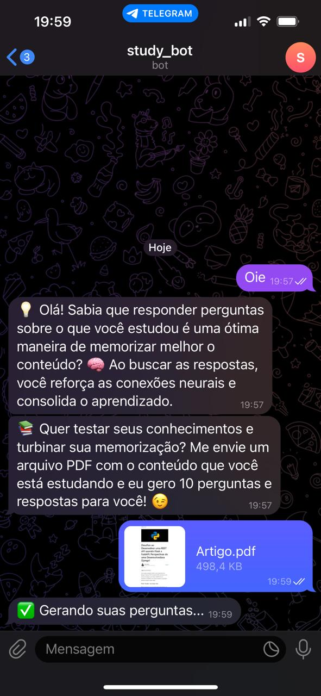
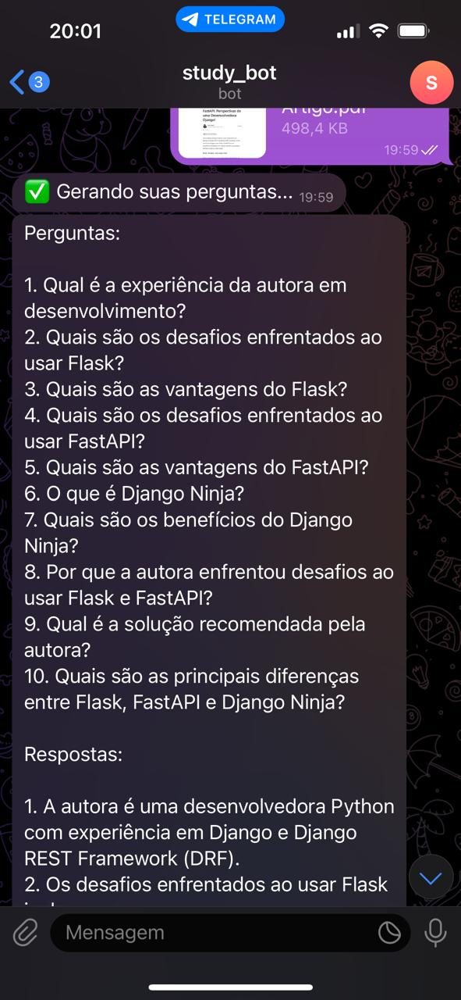
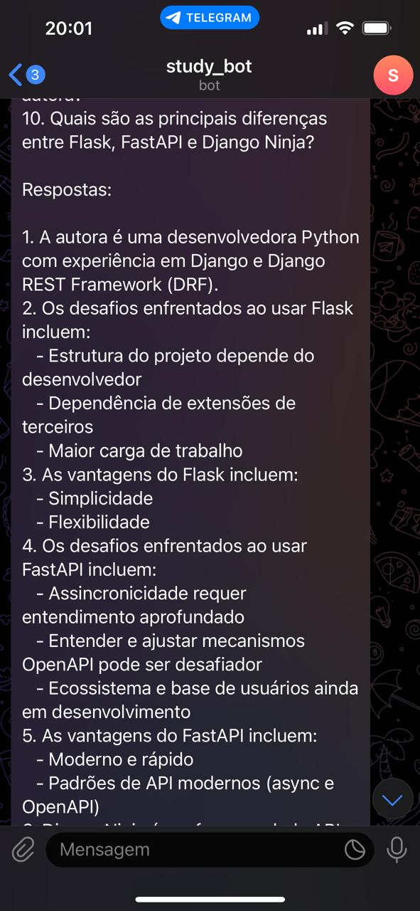
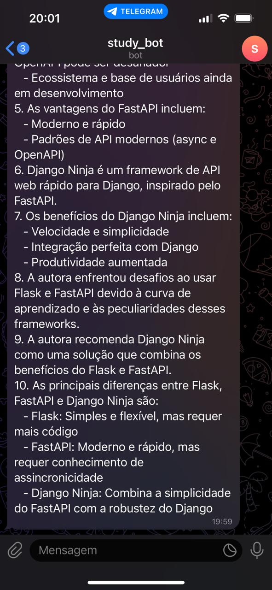

# EstudoBot: Turbinando seu aprendizado com IA

O EstudoBot é um chatbot do Telegram que te ajuda a aprender de forma mais eficaz e divertida! 📚

## Como funciona?

Simples! Envie um arquivo PDF com o conteúdo que você está estudando e o EstudoBot, utilizando o poder da IA do Google Gemini, gera 10 perguntas e respostas personalizadas para você testar seus conhecimentos e turbinar sua memorização.

|  |  |  | 

## Começando:

### 1. Crie seu bot no Telegram:

- Envie uma mensagem para o BotFather (@BotFather) no Telegram.
- Siga as instruções para criar um novo bot e obter seu token.
- Insira esse token em const.py, substituindo CHAT_TOKEN.

### 2. Obtenha sua chave de API do Google Gemini:

- Acesse o [Google AI Platform](https://cloud.google.com/vertex-ai?hl=pt_br) e crie um projeto.
- Ative a API do Google Gemini.
- Crie credenciais e obtenha sua chave de API.
- Insira essa chave em const.py, substituindo GOOGLE_API_KEY.

### 3. Instale as dependências:

> pip install -r requirements.txt

### 4.Execute o bot:

> python chat.py

Pronto! Agora você pode interagir com o EstudoBot no Telegram! 🎉

## Observações:

O EstudoBot está em constante desenvolvimento, novas funcionalidades serão adicionadas em breve! ⚡
Se você encontrar algum problema, por favor, reporte na seção de issues do repositório.
